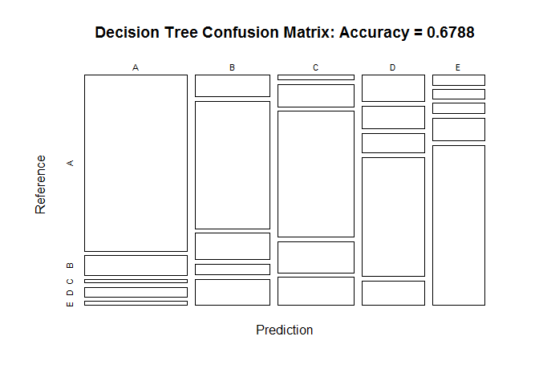
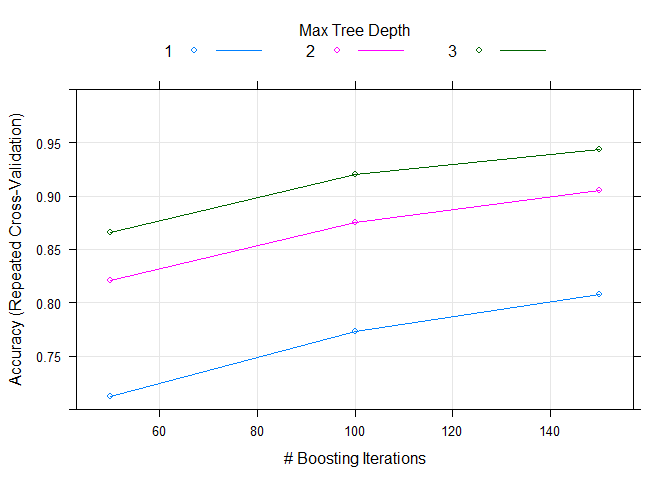

# Practical Machine Learning Course Project
Albert Shuxiang Li  
January 28, 2016  
# Project Background

Using devices such as Jawbone Up, Nike FuelBand, and Fitbit it is now possible to collect a large amount of data about personal activity relatively inexpensively. These type of devices are part of the quantified self movement – a group of enthusiasts who take measurements about themselves regularly to improve their health, to find patterns in their behavior, or because they are tech geeks. One thing that people regularly do is quantify how much of a particular activity they do, but they rarely quantify how well they do it. In this project, your goal will be to use data from accelerometers on the belt, forearm, arm, and dumbell of 6 participants. They were asked to perform barbell lifts correctly and incorrectly in 5 different ways. More information is available from the website here: http://groupware.les.inf.puc-rio.br/har (see the section on the Weight Lifting Exercise Dataset).

# Data Source of Project

The training data for this project are available here:
https://d396qusza40orc.cloudfront.net/predmachlearn/pml-training.csv

The test data are available here:
https://d396qusza40orc.cloudfront.net/predmachlearn/pml-testing.csv

The data for this project come from this source: http://groupware.les.inf.puc-rio.br/har. 

# Project Objective

The goal of this project is to predict the manner in which they did the exercise. This is the "classe" variable in the training set. Any of the other variables can be used to predict with. Following questions will be answered in this write up.

1. How the prediction models are built? 
2. How cross validation being used? 
3. What the expected out of sample error is?
4. Why the choices of prediction model?
5. Show prediction result for 20 different test cases with chosen prediction model? 

# Process Data
## Download Data and Load into System

```r
set.seed(3606)
library(caret); library(rpart); library(rpart.plot); library(RColorBrewer)
```

```
## Loading required package: lattice
## Loading required package: ggplot2
```

```r
library(rattle); library(randomForest); library(knitr); library(gbm)
```

```
## Rattle: A free graphical interface for data mining with R.
## Version 4.0.5 Copyright (c) 2006-2015 Togaware Pty Ltd.
## Type 'rattle()' to shake, rattle, and roll your data.
## randomForest 4.6-12
## Type rfNews() to see new features/changes/bug fixes.
## Loading required package: survival
## 
## Attaching package: 'survival'
## 
## The following object is masked from 'package:caret':
## 
##     cluster
## 
## Loading required package: splines
## Loading required package: parallel
## Loaded gbm 2.1.1
```

```r
Url_train <- "https://d396qusza40orc.cloudfront.net/predmachlearn/pml-training.csv"
Url_test <- "https://d396qusza40orc.cloudfront.net/predmachlearn/pml-testing.csv"
training <- read.csv(url(Url_train), na.strings=c("NA", "#DIV/0!", ""))
testing <- read.csv(url(Url_test), na.strings=c("NA", "#DIV/0!", ""))
# dim(training); dim(testing)
```
## Clean Data
### Remove NearZeroVariance variables

```r
nzv <- nearZeroVar(training, saveMetrics = TRUE)
training <- training[, nzv$nzv==FALSE]
```
### Remove variables which contain more than 55% NA

```r
trainingTEMP <- training
for(i in 1:length(training)) {
    if( sum( is.na( training[, i] ) ) /nrow(training) >= .55) {
        for(j in 1:length(trainingTEMP)) {
            if( length( grep(names(training[i]), names(trainingTEMP)[j]) ) == 1)  {
                trainingTEMP <- trainingTEMP[ , -j]
            }   
        } 
    }
}
training <- trainingTEMP; rm(trainingTEMP)
```
### Remove irrelavent variables
After check with str(training), it is recongnized that the first 6 columns (variables) are NOT related to movement, thus we can remove them: 
1. X  
2. user_name  
3. raw_timestamp_part_1  
4. raw_timestamp_part_2  
5. cvtd_timestamp  
6. num_window

```r
training = training[,-c(1:6)]
```
### Remove highly correlated variables

```r
x1 <- training[, -53]; correlation.matrix <- cor(x1)
highly.correlated <- findCorrelation(correlation.matrix, cutoff=0.75)
# print(names(training)[highly.correlated])
training <- training[, -highly.correlated]
# dim(training); str(training)
```
## Partition training set into two sets

```r
inTrain <- createDataPartition(training$classe, p=0.6, list=FALSE)
myTraining <- training[inTrain, ]
myTesting <- training[-inTrain, ]
# dim(myTraining); dim(myTesting); dim(testing)
```
## Sync myTesting, myTesting and testing columns

```r
myTesting <- myTesting[colnames(myTraining)]
testing <- testing[colnames(myTraining[, -32])] # no classe variable in testing
# dim(myTraining); dim(myTesting); dim(testing) 
# therefore, there are 31 predictors being used
```

# Predict Utilizing Decision Trees

```r
t5 <- Sys.time(); set.seed(3606)
modFitDT <- rpart::rpart(classe ~ ., data=myTraining, method="class")
rattle::fancyRpartPlot(modFitDT)
```

 

```r
predictionsDT <- predict(modFitDT, myTesting, type = "class")
confusionMatrixDT <- confusionMatrix(predictionsDT, myTesting$classe)
confusionMatrixDT
```

```
## Confusion Matrix and Statistics
## 
##           Reference
## Prediction    A    B    C    D    E
##          A 1849  246   69   91   30
##          B  137  874  172   90  185
##          C   99  229 1017  285  276
##          D   72  120   55  707  107
##          E   75   49   55  113  844
## 
## Overall Statistics
##                                           
##                Accuracy : 0.6744          
##                  95% CI : (0.6639, 0.6847)
##     No Information Rate : 0.2845          
##     P-Value [Acc > NIR] : < 2.2e-16       
##                                           
##                   Kappa : 0.5878          
##  Mcnemar's Test P-Value : < 2.2e-16       
## 
## Statistics by Class:
## 
##                      Class: A Class: B Class: C Class: D Class: E
## Sensitivity            0.8284   0.5758   0.7434  0.54977   0.5853
## Specificity            0.9223   0.9077   0.8628  0.94604   0.9544
## Pos Pred Value         0.8092   0.5995   0.5336  0.66635   0.7430
## Neg Pred Value         0.9311   0.8992   0.9409  0.91466   0.9109
## Prevalence             0.2845   0.1935   0.1744  0.16391   0.1838
## Detection Rate         0.2357   0.1114   0.1296  0.09011   0.1076
## Detection Prevalence   0.2912   0.1858   0.2429  0.13523   0.1448
## Balanced Accuracy      0.8754   0.7417   0.8031  0.74790   0.7699
```

```r
plot(confusionMatrixDT$table, col = confusionMatrixDT$byClass, 
     main = paste("Decision Tree Confusion Matrix: Accuracy =", round(confusionMatrixDT$overall['Accuracy'], 4)))
```

 

```r
t6 <- Sys.time(); t6-t5
```

```
## Time difference of 9.81996 secs
```

# Predict Utilizing Random Forests

```r
t7 <- Sys.time(); set.seed(3606)
modFitRF <- randomForest(classe ~ ., data=myTraining)
predictionRF <- predict(modFitRF, myTesting, type = "class")
ConfusionMatrixRF <- confusionMatrix(predictionRF, myTesting$classe)
ConfusionMatrixRF; plot(modFitRF, main="Final Model with Random Forests")
```

```
## Confusion Matrix and Statistics
## 
##           Reference
## Prediction    A    B    C    D    E
##          A 2228    5    0    0    0
##          B    3 1508   12    0    0
##          C    1    4 1344   17    0
##          D    0    0   10 1266    4
##          E    0    1    2    3 1438
## 
## Overall Statistics
##                                           
##                Accuracy : 0.9921          
##                  95% CI : (0.9899, 0.9939)
##     No Information Rate : 0.2845          
##     P-Value [Acc > NIR] : < 2.2e-16       
##                                           
##                   Kappa : 0.99            
##  Mcnemar's Test P-Value : NA              
## 
## Statistics by Class:
## 
##                      Class: A Class: B Class: C Class: D Class: E
## Sensitivity            0.9982   0.9934   0.9825   0.9844   0.9972
## Specificity            0.9991   0.9976   0.9966   0.9979   0.9991
## Pos Pred Value         0.9978   0.9902   0.9839   0.9891   0.9958
## Neg Pred Value         0.9993   0.9984   0.9963   0.9970   0.9994
## Prevalence             0.2845   0.1935   0.1744   0.1639   0.1838
## Detection Rate         0.2840   0.1922   0.1713   0.1614   0.1833
## Detection Prevalence   0.2846   0.1941   0.1741   0.1631   0.1840
## Balanced Accuracy      0.9987   0.9955   0.9895   0.9912   0.9981
```

 

```r
plot(ConfusionMatrixRF$table, col = ConfusionMatrixRF$byClass, 
     main = paste("Random Forest Confusion Matrix: Accuracy =", round(ConfusionMatrixRF$overall['Accuracy'], 4)))
```

 

```r
t8 <- Sys.time(); t8 - t7
```

```
## Time difference of 1.929168 mins
```

# Predict Utilizing Gradient Boosting Machine

```r
t9 <- Sys.time(); set.seed(3606)
fitControl <- trainControl(method = "repeatedcv", number = 5, repeats = 2, allowParallel = TRUE)
modFitGBM <- train(classe ~ ., data = myTraining, method = "gbm", trControl = fitControl, verbose = FALSE)
```

```
## Loading required package: plyr
```

```r
prodictionGBM <- predict(modFitGBM, newdata=myTesting)
ConfusionMatrixGBM <- confusionMatrix(prodictionGBM, myTesting$classe)
ConfusionMatrixGBM; plot(modFitGBM, ylim=c(0.8, 1))
```

```
## Confusion Matrix and Statistics
## 
##           Reference
## Prediction    A    B    C    D    E
##          A 2175   48    2    0    7
##          B   27 1407   75   14   16
##          C   12   53 1262   49   12
##          D   16    6   27 1208   16
##          E    2    4    2   15 1391
## 
## Overall Statistics
##                                           
##                Accuracy : 0.9486          
##                  95% CI : (0.9435, 0.9534)
##     No Information Rate : 0.2845          
##     P-Value [Acc > NIR] : < 2.2e-16       
##                                           
##                   Kappa : 0.935           
##  Mcnemar's Test P-Value : 4.456e-09       
## 
## Statistics by Class:
## 
##                      Class: A Class: B Class: C Class: D Class: E
## Sensitivity            0.9745   0.9269   0.9225   0.9393   0.9646
## Specificity            0.9898   0.9791   0.9805   0.9901   0.9964
## Pos Pred Value         0.9745   0.9142   0.9092   0.9489   0.9837
## Neg Pred Value         0.9898   0.9824   0.9836   0.9881   0.9921
## Prevalence             0.2845   0.1935   0.1744   0.1639   0.1838
## Detection Rate         0.2772   0.1793   0.1608   0.1540   0.1773
## Detection Prevalence   0.2845   0.1962   0.1769   0.1622   0.1802
## Balanced Accuracy      0.9822   0.9530   0.9515   0.9647   0.9805
```

 

```r
t10 <- Sys.time(); t10 - t9
```

```
## Time difference of 12.52296 mins
```
  
__"Repeated Cross Validation" is included in GBM modeling shown above (method='repeatedcv').__  

# Predict Test Data Set
When train data with myTraining, and predict outcome of myTesting, the accuracy of various methods are:

1. Decision Tree = 67.44%;
2. Random Forests = 99.21%;
3. Generalized Boosted Regression = 94.86%.  

Therefore, __Random Forest__ method will be used to make prediction here. Thus, the __expected out-of-sample error__ 
is 100% - 99.21% __= 0.79%__.  

 __The Prediction Results are listed as below__  


```r
set.seed(3606)
predictionTEST <- predict(modFitRF, testing, type = "class")
predictionTEST
```

```
##  1  2  3  4  5  6  7  8  9 10 11 12 13 14 15 16 17 18 19 20 
##  B  A  B  A  A  E  D  B  A  A  B  C  B  A  E  E  A  B  B  B 
## Levels: A B C D E
```
# Summary
1. From original 159 variables, __31 variables__ are selected to predict variable "classe".
2. Following techniques have been used to clean up the data set
  + remove NearZeroVariance variables  
  + remove variables which contain more than 55% NA  
  + remove irrelavent variables  
  + remove highly correlated variables
3. Among three algorithm (Decision Tree, Random Forest and Garident Boosting Machine) investigated, __Random Forest__ perform better, with which __99.21% accurary__ is obtained.
4. Cross Validation is employed inside the prediction method through R package.
5. A prediction for "testing" data set has been made, shown in section "Predict Test Data Set".
